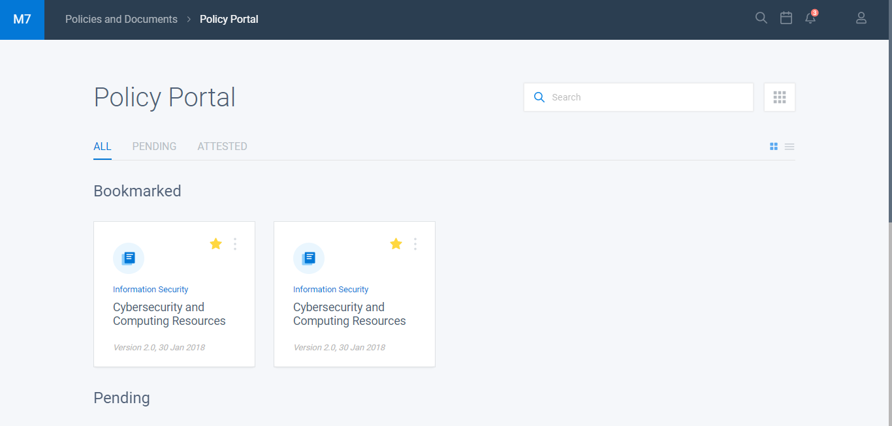

<h1>Policy Portal</h1>

 
 

# Project
 
This project it's a policy portal app inspired on a layout I've found around the web built with Angular and SASS using JSON Server as fake API
# Technologies
- Angular
- RxJS
- SASS
- JEST
- JSON Server

# Running project

- 1º - Clone this project to your local machine
- 2º - Install all dependencies running `npm install`
- 3º - Install JSON Server running `npm install -g json-server`
## Development server

- 1º - First run `json-server --watch api/backend.json` to start the JSON Server fake API REST 
- 2º - After run `npm start` for a dev server. 
- 3º - Then navigate to `http://localhost:4200/`. The app will automatically reload if you change any of the source files.

## Build

Run `npm build` to build the project. The build artifacts will be stored in the `dist/` directory.

## Running unit tests

Run `npm run test` to execute the unit tests via [Jest](https://jestjs.io/pt-BR/).

